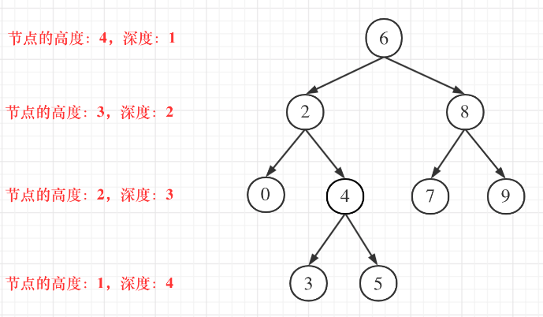

# 🤔 day29

## 代码随想录算法训练营第二十九天| 二叉树 110 257 404

### 110 平衡二叉树

题目链接：[https://leetcode.cn/problems/balanced-binary-tree/](https://leetcode.cn/problems/balanced-binary-tree/)

文章讲解：[https://programmercarl.com/0110.%E5%B9%B3%E8%A1%A1%E4%BA%8C%E5%8F%89%E6%A0%91.html](https://programmercarl.com/0110.%E5%B9%B3%E8%A1%A1%E4%BA%8C%E5%8F%89%E6%A0%91.html)

视频讲解：[https://www.bilibili.com/video/BV1Ug411S7my](https://www.bilibili.com/video/BV1Ug411S7my)

**思路**

在写这道题的时候，先把之前没有仔细学过的二叉树的迭代法以及递归回溯的完成过程学习了一遍，这里记录一下二叉树的高度和深度的概念

* 二叉树节点的高度：指从该节点到叶子节点的最长简单路径边的条数
* 二叉树节点的深度：指从根节点到该节点的最长简单路径边的条数

也即，高度是从下往上数，而深度是从上往下数

<div align="left">

<figure><figcaption></figcaption></figure>

</div>

因此，求二叉树的深度：

* 前序遍历
  * 先有当前节点的深度
  * 左右子树的深度 + 1
* 层序遍历
  * 层数即深度

二叉树的高度：

* 后序遍历
  * 先求左右子树高度
  * 取较大值后 + 1（当前节点）

在这道题中，判断一颗二叉树是否为平衡二叉树，就要判断每一个节点的左右子树的高度差是否小于等于 1

根据上面的讲解，求高度就需要使用**后序遍历**，同时需要添加一个判断的过程：

* 左右子树的高度差
* 是否已经存在以某一个节点为根节点的二叉树不是平衡二叉树

**1. 求左右子树的高度**

```go
func getHeight(treeNode *TreeNode) int {
	if treeNode == nil {
		return 0
	}
    
	lh, rh := getHeight(treeNode.Left), getHeight(treeNode.Right)
    
	return max(lh, rh) + 1
}
```

**2. 判断**

判断左右子树的高度差是否满足要求，不满足则返回 -1

```go
if lh-rh > 1 || rh-lh > 1 {
    return -1
}
```

判断是否已有节点不符合要求

```go
if lh == -1 || rh == -1 {
    return -1
}
```

[完整代码](https://github.com/hd2yao/leetcode/tree/master/training/day29/0110\_balanced\_binary\_tree.go)

### 257 二叉树的所有路径

题目链接：[https://leetcode.cn/problems/binary-tree-paths/](https://leetcode.cn/problems/binary-tree-paths/)

文章讲解：[https://programmercarl.com/0257.%E4%BA%8C%E5%8F%89%E6%A0%91%E7%9A%84%E6%89%80%E6%9C%89%E8%B7%AF%E5%BE%84.html](https://programmercarl.com/0257.%E4%BA%8C%E5%8F%89%E6%A0%91%E7%9A%84%E6%89%80%E6%9C%89%E8%B7%AF%E5%BE%84.htmlhttps://programmercarl.com/0257.%E4%BA%8C%E5%8F%89%E6%A0%91%E7%9A%84%E6%89%80%E6%9C%89%E8%B7%AF%E5%BE%84.html)

视频讲解：[https://www.bilibili.com/video/BV1ZG411G7Dh](https://www.bilibili.com/video/BV1ZG411G7Dh)

**思路**

首先这道题需要记录路径，即从根节点到叶子节点，那么就要使用前序遍历

下面来看递归的部分

**1. 递归参数与返回值**

要传入当前节点，以及路径，还有存放的结果集，而不需要返回值

因为每一条结果都在递归过程中存入结果集中

**2. 终止条件**

当找到叶子节点就结束递归

按照以往的写法

```go
if treeNode == nil {
    // 结束前的逻辑处理
    return
}
```

我们考虑一下这种写法是否合理，单独只考虑这部分是没有问题的，但是我们考虑一下每一次递归的逻辑

因为叶子节点只需要将值保存即可，而不需要在之后加上 "->"，因此我们需要区别叶子节点和非叶子节点，而非当前节点是否为 nil，因为叶子节点也不为 nil

除此之外，如果使用上面的写法，当一个节点为叶子节点时，后续递归就是传入左右子节点，而这时的两个左右子节点都为 nil，也就是说当前的路径会处理两遍

综上所述，我们需要判断当前节点是否为叶子节点来作为终止条件

```go
if treeNode.Left == nil && treeNode.Right == nil {
    return
}
```

同时控制空节点不入循环，以免出现 treeNode == nil，然后上面判断是否为叶子节点时报错（指针异常）

```go
if treeNode.Left != nil {
    preorderPath(treeNode.Left, path, paths)
}

if treeNode.Right != nil {
    preorderPath(treeNode.Right, path, paths)
}
```

**3. 确定单层逻辑**

当前节点不为叶子节点，就将节点值存入字符串，然后加上 "->"

```go
path += strconv.Itoa(treeNode.Val) + "->"
if treeNode.Left != nil {
    preorderPath(treeNode.Left, path, paths)
}

if treeNode.Right != nil {
    preorderPath(treeNode.Right, path, paths)
}
```

在遇到叶子节点时，只保存节点值，然后存入结果集，一次递归结束

[完整代码](https://github.com/hd2yao/leetcode/tree/master/training/day29/0257\_binary\_tree\_paths.go)

### 404 左子叶之和

题目链接：[https://leetcode.cn/problems/sum-of-left-leaves/](https://leetcode.cn/problems/sum-of-left-leaves/)

文章讲解：[https://programmercarl.com/0404.%E5%B7%A6%E5%8F%B6%E5%AD%90%E4%B9%8B%E5%92%8C.html](https://programmercarl.com/0404.%E5%B7%A6%E5%8F%B6%E5%AD%90%E4%B9%8B%E5%92%8C.html)

视频讲解：[https://www.bilibili.com/video/BV1GY4y1K7z8](https://www.bilibili.com/video/BV1GY4y1K7z8)

**思路**

这道题没有太明白

[完整代码](https://github.com/hd2yao/leetcode/tree/master/training/day29/0404\_sum\_of\_left\_leaves.go)
