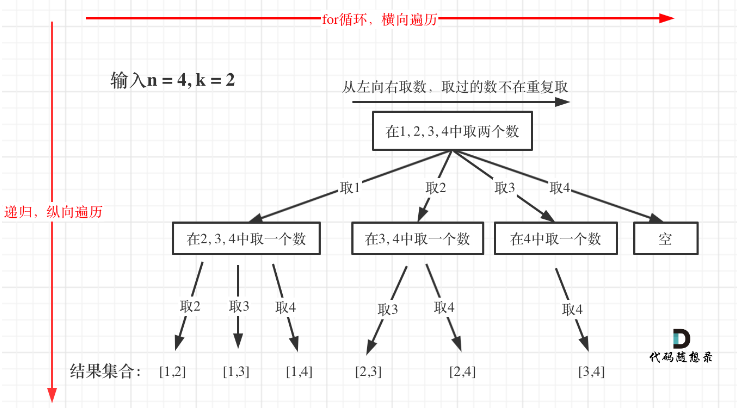
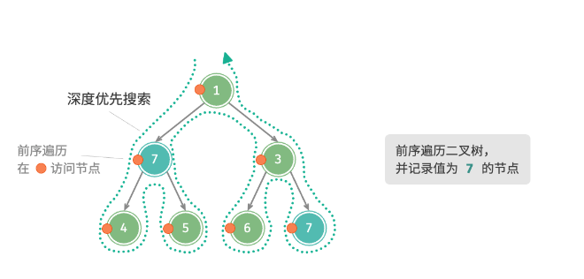

# 😲 day37

## 代码随想录算法训练营第三十七天| 回溯法 77 216 17

### 回溯法

**1. 什么是回溯法**

回溯是递归的副产品，只要有递归就会有回溯

回溯函数就是递归函数

**2. 回溯法的效率**

回溯法的本质就是穷举，高效一些的方法，就是加一些剪枝的操作

**3. 回溯法解决的问题**

回溯法一般可以解决以下几种问题：

* 组合问题：N 个数里面按一定规则找出 k 个数的集合
* 切割问题：一个字符串按一定规则有几种切割方式
* 子集问题：一个 N 个数的集合里有多少符合条件的子集
* 排列问题：N 个数按一定规则全排列，有几种排列方式
* 棋盘问题：N 皇后，解数独问题

> 组合和排列的区别？
>
> 组合不强调元素顺序的，排列强调元素顺序

**4. 如何理解回溯法**

回溯法解决的问题都可以抽象为树形结构

回溯法解决的都是在集合中递归查找子集，集合的大小就构成了树的宽度，递归的深度就构成了树的深度

递归就要有终止条件，所以必然是一棵高度有限的树（N 叉树）

**5. 回溯法模板**

递归三部曲，即回溯三部曲

* 回溯函数模板返回值以及参数
* 回溯函数终止条件
* 回溯搜索的遍历过程

***

### 77 组合

题目链接：[https://leetcode.cn/problems/combinations/](https://leetcode.cn/problems/combinations/)

文章讲解：[https://programmercarl.com/0077.%E7%BB%84%E5%90%88.html](https://programmercarl.com/0077.%E7%BB%84%E5%90%88.html)

视频讲解：[https://www.bilibili.com/video/BV1ti4y1L7cv](https://www.bilibili.com/video/BV1ti4y1L7cv)

**思路**

回溯算法就是在回溯函数中嵌套着 for 循环，for 循环又嵌套着回溯函数进行递归

<div align="left">

<figure><figcaption></figcaption></figure>

</div>

* for 循环代表着树的一层节点，依次进行遍历
* 每一层递归就代表着树向下开辟新的一层
* 终止条件就代表着已经到达树的最深一层，即到达叶子节点
* 一层递归结束，就回溯到上一层节点，然后进行 for 遍历这一层的其他节点，然后也会有新的递归，即向下寻找到另一个叶子节点

上面的回溯过程就是二叉树中深度优先搜索以前序遍历进行访问的过程

* 我们寻找的每一个组合结果就是在寻找每一个叶子节点
* 每一个组合的数量达到 k 也就是对应叶子节点，即终止条件

<div align="left">

<figure><figcaption></figcaption></figure>

</div>

我们开始的时候有说过，回溯中提高效率的方式就是剪枝

那么这道题剪枝的方式，

**列表中剩余元素 >= 所需元素**

如何理解？

当前 path 中还需要两个元素才能构成一个组合，而此时可选取的元素还剩下一个，那么就没有必要再进行一遍上面的过程，而是可以直接舍去

`len(path)` 表示当前组合中的元素个数，`k - len(path)` 表示组合中还需要的元素个数

`i` 表示 `[1,n]` 的列表中从 `i` 开始，也是第 `i` 个元素，那么当前列表元素就是 `[i,n]`，列表中剩余元素的个数就是 `n - i + 1`

上面剪枝的方式转换成代数形式就是，

`n - i + 1 >= k - len(path)`，移项后为 `i <= n - (k - len(path)) + 1`

也就是说，在我们每次遍历节点的时候，要根据剪枝的条件去判断，而遍历节点就是 for 循环，所以代码如下，

```go
for i := startIndex; i <= n - (k - len(path)) + 1; i++ {
    path = append(path, i)
    backtracking(n, k, i+1)
    path = path[:len(path)-1]
}
```

[完整代码](https://github.com/hd2yao/leetcode/tree/master/training/day37/0077\_combinations.go)

### 216 组合总和3

题目链接：[https://leetcode.cn/problems/combination-sum-iii/](https://leetcode.cn/problems/combination-sum-iii/)

文章讲解：[https://programmercarl.com/0216.%E7%BB%84%E5%90%88%E6%80%BB%E5%92%8CIII.html](https://programmercarl.com/0216.%E7%BB%84%E5%90%88%E6%80%BB%E5%92%8CIII.html)

视频讲解：[https://www.bilibili.com/video/BV1wg411873x](https://www.bilibili.com/video/BV1wg411873x)

**思路**

**未剪枝**

和上面 组合 是类似的，只是在终止条件处多加了一个判断，计算一下当前组合的总和，满足总和值的才放入结果集中

这里可以优化一下，将递归的函数多加一个参数，用来记录当前 path 中元素的总和，而无需每次计算一遍

```go
var backtracking func(k, sum, n, startIndex int)
backtracking = func(k, sum, n, startIndex int) {
    if len(path) == k {
        if sum == n {
            tmp := make([]int, k)
            copy(tmp, path)
            result = append(result, path)
        }
        return
    }
    
    for i := startIndex; i <= 9; i++ {
        path = append(path, i)
        backtracking(k, sum+i, n, i+1)
        path = path[:len(path)-1]
    }
}
```

**剪枝**

这里可以剪枝的条件有两个：

* 同组合，列表剩余元素 >= 组合所需元素
* 组合总和已大于 n

这里要使用第二个条件剪枝的话，就需要使用上面优化后递归参数加入 sum 的方法，这种方法会在递归前先求和

[完整代码](https://github.com/hd2yao/leetcode/tree/master/training/day37/0216\_combination\_sum\_iii.go)

### 17 电话号码的字母组合

题目链接：[https://leetcode.cn/problems/letter-combinations-of-a-phone-number/](https://leetcode.cn/problems/letter-combinations-of-a-phone-number/)

文章讲解：[https://programmercarl.com/0017.%E7%94%B5%E8%AF%9D%E5%8F%B7%E7%A0%81%E7%9A%84%E5%AD%97%E6%AF%8D%E7%BB%84%E5%90%88.html](https://programmercarl.com/0017.%E7%94%B5%E8%AF%9D%E5%8F%B7%E7%A0%81%E7%9A%84%E5%AD%97%E6%AF%8D%E7%BB%84%E5%90%88.html)

视频讲解：[https://www.bilibili.com/video/BV1yV4y1V7Ug](https://www.bilibili.com/video/BV1yV4y1V7Ug)

[完整代码](https://github.com/hd2yao/leetcode/tree/master/training/day37/0017\_letter\_combinations\_of\_a\_phone\_number.go)
