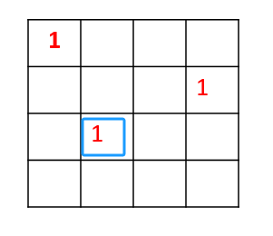
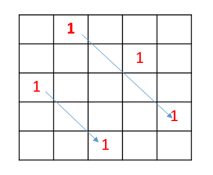

# 😵 day44

## 代码随想录算法训练营第四十四天| 回溯法 51 37

### 51 N皇后

题目链接：[https://leetcode.cn/problems/n-queens/](https://leetcode.cn/problems/n-queens/)

文章讲解：[https://programmercarl.com/0051.N%E7%9A%87%E5%90%8E.html](https://programmercarl.com/0051.N%E7%9A%87%E5%90%8E.html)

视频讲解：[https://www.bilibili.com/video/BV1Rd4y1c7Bq/](https://www.bilibili.com/video/BV1Rd4y1c7Bq/)

**思路**

我先手动模拟了一下使用回溯法构造树的过程

**第一步，先构造整体的框架**

递归终止

* 寻找到叶子节点为止

单层递归逻辑

* 树的每一层，即一层 for 代表在当前行中寻找合适的皇后的位置
* 直到叶子节点，每一次递归，代表去下一行寻找皇后的位置

递归参数

* for 表示在一行中依次寻找，即列
* 因此，参数需要传入 行row 而不需要 列col

**第二步，判断位置是否合法**

我是使用两个切片，分别记录某一行某一列是否存在皇后，然后以此来判断是否合法

```go
rowMark := make([]int, n)
colMark := make([]int, n)
```

因为，我们是从上向下一行一行寻找，所以只需要考虑上一行的关系

* 回溯的逻辑决定了，不可能在同一行，无需判断
* 需要判断当前列是否已有皇后
* 判断对角线，因为我们只考虑上一行，而第一行无需考虑与上一行的对角线
  * col = 0，只考虑右上角
  * col != 0 && col != n-1，要考虑左右上角
  * col = n-1，只考虑左上角

代码如下

```go
if colMark[col] == 1 {
	continue
}

if row != 0 && rowMark[row-1] == 1 && 
    (
        (col != 0 && col != n-1 && (colMark[col-1] == 1 || colMark[col+1] == 1)) || 
        (col == 0 && colMark[col+1] == 1) || 
        (col == n-1 && colMark[col-1] == 1)
    ) {
    continue
}
```

但是上面的情况不能保证是在对角线上

<div align="left">

<figure><figcaption></figcaption></figure>

</div>

如上图的第三行，和第一行不是对角线，但是在判断的第一部分时，`col != 0 && col != n-1 && colMark[col-1] == 1` 是符合的，

即 `rowMark[i] == 1 && colMark[i] == 1` 并不能保证是同一个元素，也可能分别对应两个元素

因此，我们还是需要使用二维数组来去判断

也不能只考虑与上一行的对角关系，

<div align="left">

<figure><figcaption></figcaption></figure>

</div>

所以还是要沿着左上和右上两条对角线去判断

[完整代码](https://github.com/hd2yao/leetcode/tree/master/training/day44/0051\_n\_queens.go)

### 37 解数独

题目链接：[https://leetcode.cn/problems/sudoku-solver/](https://leetcode.cn/problems/sudoku-solver/)

文章讲解：[https://programmercarl.com/0037.%E8%A7%A3%E6%95%B0%E7%8B%AC.html](https://programmercarl.com/0037.%E8%A7%A3%E6%95%B0%E7%8B%AC.html)

视频讲解：[https://www.bilibili.com/video/BV1TW4y1471V/](https://www.bilibili.com/video/BV1TW4y1471V/)

**思路**

我只能说这道题是真有难度，一层 for 还不够，要两层 for

一层 for 用来填充行，一层 for 用来填充列，通过两个 for 才能确定一个点

然后通过递归来判断，当前位置放置哪一个数值是合法的

N 皇后只需要判断当前位置是否合法，数独不仅要判断位置，还需要判断当前位置的值

更详细的讲解去看文章还有视频吧

**return true 和 return false**

这里想说一下最后返回 true 和 false 的逻辑

首先，因为题目只有一个唯一解，也就是说不需要我们遍历整个树，只有找到一组解我们就可以直接返回，所以递归函数需要一个 bool 的返回值， 然后将 true 一层一层返回即可

```go
var backtracking func(board [][]byte) bool

if backtracking(board) {
    return true
}
```

其次，既然函数有返回值，那么我们就需要考虑在哪里返回 true 和 false

> 这里要注意，上面代码中的 return true 并不是函数的一个最终返回，只是函数中的一个剪枝； 因为只有在上一层先 return true 这一层才能接收到进行判断

* `return false`

返回 false 说明没有找到合适的值放入

我们在空格处会尝试 1 - 9，只有这九个数都不满足，说明没有找到一组解，那么此时才返回 false

```go
for k := '1'; k <= '9'; k++ {
    // 判断当前位置是否合适放 k，不合适直接下一个数
    if isvalid(i, j, byte(k), board) {
        // 放入 k
        board[i][j] = byte(k)
        // 然后递归进行下一个数的放置
        // 因为只有一个解，所以只要找到一组就返回
        if backtracking(board) {
            return true
        }
        // 回溯
        board[i][j] = '.'
    }
}

// 说明九个数都尝试了，没有可以的数
return false
```

* `return true`

返回 true 说明我们找到了一组解，也即当前棋盘已全部填满数字

而我们进行递归的条件是：当前棋盘上有空格，然后会依次填充数字

当棋盘已满就不会走递归的逻辑，也就不会进入棋盘，所以直接在最外层返回 true

```go
if board[i][j] == '.' {
  // 空位从 1 开始尝试
  for k := '1'; k <= '9'; k++ {
    // ...
  }
  
  // 说明九个数都尝试了，没有可以的数
  return false
}
```

调整一下代码如上，当棋盘已满，就不会进行处理，也就不会 return false

当最后一个数填入，两层 for 也结束，此时已到达外层，这是一个解，所以返回 true

```go
backtracking = func(board [][]byte) bool {
    for i := 0; i < 9; i++ { // 遍历行
        for j := 0; j < 9; j++ { // 遍历列
            if board[i][j] == '.' {
              // ...
            }
            return false
        }
    }
    return true
}
```

[完整代码](https://github.com/hd2yao/leetcode/tree/master/training/day44/0037\_sudoku\_solver.go)
