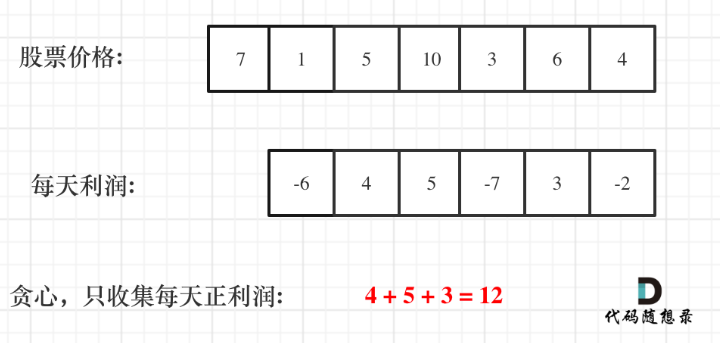

# 😖 day46

## 代码随想录算法训练营第四十六天| 贪心法 122 55 45

### 122 买卖股票的最佳时机2

题目链接：[https://leetcode.cn/problems/best-time-to-buy-and-sell-stock-ii/](https://leetcode.cn/problems/best-time-to-buy-and-sell-stock-ii/)

文章讲解：[https://programmercarl.com/0122.%E4%B9%B0%E5%8D%96%E8%82%A1%E7%A5%A8%E7%9A%84%E6%9C%80%E4%BD%B3%E6%97%B6%E6%9C%BAII.html](https://programmercarl.com/0122.%E4%B9%B0%E5%8D%96%E8%82%A1%E7%A5%A8%E7%9A%84%E6%9C%80%E4%BD%B3%E6%97%B6%E6%9C%BAII.html)

视频讲解：[https://www.bilibili.com/video/BV1ev4y1C7na](https://www.bilibili.com/video/BV1ev4y1C7na)

**思路**

我先说一下我的思路

首先是局部最优：我们在局部最低点买入，然后再在局部最高点卖出，可以保证在这个区间内的利润最大

然后全部最优：统计全部的局部最优，就能得到全局最优

我画出了数组的折现图，其实思路跟昨天的两道题类似，应该是就综合了 摆动序列 和 最大子数组和

用摆动序列的方法找到极大值和极小值，然后极小值做减法极大值做加法求最大和

想法是正确的，不过在写代码中不好去写出来，

因为可能会像示例中，在第一天买入，第三天卖出，并不是连续两天的买卖，所以直接按照上面的想法写代码是行不通的

**利润分解**

上面的想法是没错的，但是直接写是不行的，所以我们要将求利润的过程分解

假如第 0 天买入，第 3 天卖出，那么利润为：`prices[3] - prices[0]`

相当于`(prices[3] - prices[2]) + (prices[2] - prices[1]) + (prices[1] - prices[0])`

此时就是把利润分解为每天为单位的维度，而不是从 0 天到第 3 天整体去考虑！

这样我们就能得到每天的利润序列

那么根据贪心算法，我们只要每天是正利润，就能让我们的利润最大

<div align="left">

<figure><figcaption></figcaption></figure>

</div>

而利润序列，其实就是买卖股票的区间

例如上图 -6，就是第一天买入第二天卖出；像 4 和 5 可以放在一起，就是第二天买入第四天卖出

[完整代码](https://github.com/hd2yao/leetcode/tree/master/training/day46/0122\_best\_time\_to\_buy\_and\_sell\_stock\_ii.go)

### 55 跳跃游戏

题目链接：[https://leetcode.cn/problems/jump-game/](https://leetcode.cn/problems/jump-game/)

文章讲解：[https://programmercarl.com/0055.%E8%B7%B3%E8%B7%83%E6%B8%B8%E6%88%8F.html](https://programmercarl.com/0055.%E8%B7%B3%E8%B7%83%E6%B8%B8%E6%88%8F.html)

视频讲解：[https://www.bilibili.com/video/BV1VG4y1X7kB](https://www.bilibili.com/video/BV1VG4y1X7kB)

**思路**

贪心的想法，在每一步都选择最大的跳跃数

但是这样会有一个问题，当前最大的跳跃数未必是可到达的最远位置

所以不能只考虑选择几步的问题

关键在于可跳的覆盖范围，也就是说最大的跳跃步数，这个就是可以跳跃的覆盖范围！

那么这个问题就转化为跳跃覆盖范围究竟可不可以覆盖到终点！

每次移动取最大跳跃步数（得到最大的覆盖范围），每移动一个单位，就更新最大覆盖范围。

贪心算法局部最优解：每次取最大跳跃步数（取最大覆盖范围），整体最优解：最后得到整体最大覆盖范围，看是否能到终点。

很容易写出代码

```go
func canJump(nums []int) bool {
	max := 0

	for i := 0; i < len(nums); i++ {
		if max == i && nums[i] == 0 && max != len(nums)-1 {
			return false
		}
		if i+nums[i] > max {
			max = i + nums[i]
		}
		if max >= len(nums)-1 {
			return true
		}
	}

	return false
}
```

这里有一个地方需要注意，像上面的代码循环中的第一个判断条件，

是为了判断是否到达了最大的覆盖范围且不包含终点的情况

为什么需要这个，因为循环是整个数组

也就是说哪怕当前已到达最远的距离，且没有到达终点，但是因为循环，所以还是会继续向前走，这是不对的，所以增加了这个判断条件

我们可以改进一下，每次的移动范围都在最大的跳跃覆盖范围内，这样就不需要判断啦

[完整代码](https://github.com/hd2yao/leetcode/tree/master/training/day46/0055\_jump\_game.go)

### 45 跳跃游戏II

题目链接：[https://leetcode.cn/problems/jump-game-ii/](https://leetcode.cn/problems/jump-game-ii/)

文章讲解：[https://programmercarl.com/0045.%E8%B7%B3%E8%B7%83%E6%B8%B8%E6%88%8FII.html](https://programmercarl.com/0045.%E8%B7%B3%E8%B7%83%E6%B8%B8%E6%88%8FII.html)

视频讲解：[https://www.bilibili.com/video/BV1Y24y1r7XZ](https://www.bilibili.com/video/BV1Y24y1r7XZ)

**思路**

这道题我开始的想法是，统计最大范围的改变次数即可

但是这样是不对的，例如 \[7,0,9,6,9,6,1,7,9,0,1,2,9,0,3] 其实只需要两步，第一步从 7 -- 7，然后 7 -- 7 结束

如果统计最大范围的改变次数，在 7 之前就已经变了好几次，所以不能这么想

在上面这个例子中，可以得到启发，在每一步都要去判断一下，在当前的最大范围中是否有可以到达的位置； 如果没有说明需要多走一步，再选择当前范围中可以到达的最远位置作为下一步的最大范围，直至到达终点

这道题关于什么时候步数加一的代码比较绕

[完整代码](https://github.com/hd2yao/leetcode/tree/master/training/day46/0045\_jump\_game\_ii.go)
