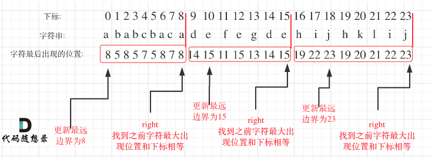

# 😛 day51

## 代码随想录算法训练营第五十一天| 贪心法 435 763 56

### 435 无重叠区间

题目链接：[https://leetcode.cn/problems/non-overlapping-intervals/](https://leetcode.cn/problems/non-overlapping-intervals/)

文章讲解：[https://programmercarl.com/0435.%E6%97%A0%E9%87%8D%E5%8F%A0%E5%8C%BA%E9%97%B4.html](https://programmercarl.com/0435.%E6%97%A0%E9%87%8D%E5%8F%A0%E5%8C%BA%E9%97%B4.html)

视频讲解：[https://www.bilibili.com/video/BV1A14y1c7E1](https://www.bilibili.com/video/BV1A14y1c7E1)

**思路**

这道题跟 **0452 用最少数量的箭引爆气球** 很像

弓箭的数量就相当于是非交叉区间的数量，那只要用总区间数减去弓箭数量就是要移除的区间数量了

[完整代码](https://github.com/hd2yao/leetcode/tree/master/training/day51/0435\_non\_overlapping\_intervals.go)

### 763 划分字母区间

题目链接：[https://leetcode.cn/problems/partition-labels/](https://leetcode.cn/problems/partition-labels/)

文章讲解：[https://programmercarl.com/0763.%E5%88%92%E5%88%86%E5%AD%97%E6%AF%8D%E5%8C%BA%E9%97%B4.html](https://programmercarl.com/0763.%E5%88%92%E5%88%86%E5%AD%97%E6%AF%8D%E5%8C%BA%E9%97%B4.html)

视频讲解：[https://www.bilibili.com/video/BV18G4y1K7d5](https://www.bilibili.com/video/BV18G4y1K7d5)

**思路**

在理解了题意之后，这道题很容易就能做一个转化：

因为每个字母只有出现在一个区间里，所以这个区间里至少要从这个字母出现的第一次开始到最后一次为止

因此，我们需要统计每个字母第一次出现的位置和最后一次出现的位置，即每个字母的区间

这样，这道题就变成了，对区间先进行合并，然后再统计有多少个非重叠区间

我写出的代码比较清晰易懂，实际上可以对上面的做一个合并，

* 统计每一个字符最后出现的位置
* 从头遍历字符，并更新字符的最远出现的下标，如果找到字符最远出现位置下标和当前下标相等，则找到了分割点

<figure><figcaption></figcaption></figure>

[完整代码](https://github.com/hd2yao/leetcode/tree/master/training/day51/0763\_partition\_labels.go)

### 56 合并区间

题目链接：[https://leetcode.cn/problems/merge-intervals/](https://leetcode.cn/problems/merge-intervals/)

文章讲解：[https://programmercarl.com/0056.%E5%90%88%E5%B9%B6%E5%8C%BA%E9%97%B4.html](https://programmercarl.com/0056.%E5%90%88%E5%B9%B6%E5%8C%BA%E9%97%B4.html)

视频讲解：[https://www.bilibili.com/video/BV1wx4y157nD](https://www.bilibili.com/video/BV1wx4y157nD)

**思路**

不用说更多，这两天做的很多了，合并区间和找重叠区间是类似的

[完整代码](https://github.com/hd2yao/leetcode/tree/master/training/day51/0056\_merge\_intervals.go)
