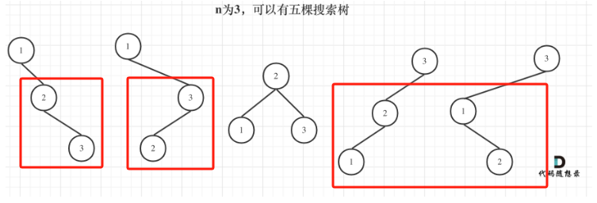
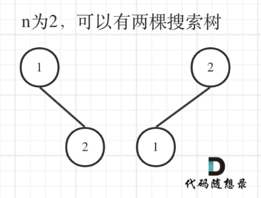

# 😋 day57

## 代码随想录算法训练营第五十七天| 动态规划 343 96

### 343 整数拆分

题目链接：[https://leetcode.cn/problems/integer-break/](https://leetcode.cn/problems/integer-break/)

文章讲解：[https://programmercarl.com/0343.%E6%95%B4%E6%95%B0%E6%8B%86%E5%88%86.html](https://programmercarl.com/0343.%E6%95%B4%E6%95%B0%E6%8B%86%E5%88%86.html)

视频讲解：[https://www.bilibili.com/video/BV1Mg411q7YJ/](https://www.bilibili.com/video/BV1Mg411q7YJ/)

**思路**

这道题，我动手写了一遍，大致搞清楚了逻辑

不过还是在看了讲解之后才更加的清晰

**1. 确定 dp 数组以及下标的含义**

`dp[i]`：拆分数字 i，得到的最大乘积为 `dp[i]`

**2. 确定递推公式**

这里我们可以先动手计算一下，

dp\[2] = 1 是显而易见的

而 dp\[3] 是根据 dp\[2] 推导出来的，dp\[3] = 2，我们选择 3 = 1 + 2，dp\[3] = 1 \* 2 = 2

我们可以看到，对于 dp\[3] 中计算拆分后的 2，我们并没有选择使用 dp\[2] 而是直接使用了 2

因此，对于一个整数 i，dp\[i] 是对 i 拆分后的最大乘积，未必会比 i 本身大

那么在后续计算过程中，我们应该选择 `max(i, dp[i])`

所以 `dp[i] = max(dp[i], max((i - j) * j, dp[i - j] * j))`

`max((i - j) * j, dp[i - j] * j)` 是进行遍历，得出每一种组合的结果，然后再取最大值

**3. dp 数组初始化**

如题意可得，dp\[2] = 1

[完整代码](https://github.com/hd2yao/leetcode/tree/master/training/day57/0343\_integer\_break.go)

### 96 不同的二叉搜索树

题目链接：[https://leetcode.cn/problems/unique-binary-search-trees/](https://leetcode.cn/problems/unique-binary-search-trees/)

文章讲解：[https://programmercarl.com/0096.%E4%B8%8D%E5%90%8C%E7%9A%84%E4%BA%8C%E5%8F%89%E6%90%9C%E7%B4%A2%E6%A0%91.html](https://programmercarl.com/0096.%E4%B8%8D%E5%90%8C%E7%9A%84%E4%BA%8C%E5%8F%89%E6%90%9C%E7%B4%A2%E6%A0%91.html)

视频讲解：[https://www.bilibili.com/video/BV1eK411o7QA/](https://www.bilibili.com/video/BV1eK411o7QA/)

**思路**

动手模拟了一下，n = 4 的时候就要画死了

发现了有规律，但是没有从中找到什么连续的联系

下面我结合讲解记录一下，

首先先给出 n = 3 的情况，

<figure><figcaption></figcaption></figure>

注意看，我们分别以 1,2,3 为根节点构造的二叉搜索树

当 1 为根节点的时候与 3 为根节点的结果恰好是对称的，个数也是相同的

那是不是就是说，我们只用计算前一半的个数即可，这个想法是正确的，但是还是无法直接得到结果，因为我们还是要计算前一半的情况

不过我们接着上面的思路去深入考虑一下，

<figure><figcaption></figcaption></figure>

上图是 n = 2 的情况，我们对比看一下 n = 3 中红框的部分，如果忽略节点的值，我们可以发现

在 n = 3 时，1 和 3 为根节点时，子树跟 n = 2 的布局情况是一致的！

因为我们要构造的是二叉搜索树，当我们确定了根节点后，左右子树的个数也就确定了，而子树的布局情况只跟子树的节点个数有关

这样我们就能够得到一个推导公式

`dp[i] += dp[j - 1] * dp[i - j]` j-1 为 j 为根结点左子树节点数量，i-j 为以 j 为根结点右子树节点数量

[完整代码](https://github.com/hd2yao/leetcode/tree/master/training/day57/0096\_unique\_binary\_search\_trees.go)
